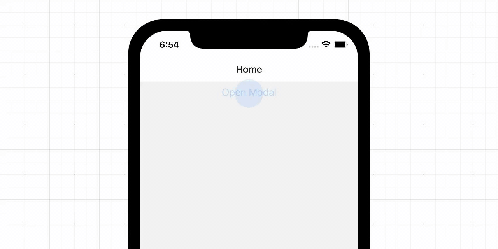

# React Navigation Scrollable Modal

This is a POC to replicate the native interaction behavior of iOS modal presentation with React Navigation.



---

### Usage

In order to get this functionality working in your project, you have to:

- Copy `patches/@react-navigation+stack+6.0.7.patch` into your project root folder.
- Copy `src/useCardModalGestureInteraction.ts` into any place in your project.
- add `"postinstall": "npx patch-package"` into your project `package.json` in `scripts` node.
- run `yarn`

```tsx
export const ScrollableModalScreen = () => {
  const scrollableRef = useAnimatedRef<FlatList>();

  const { scrollableGestureRef, handleScrolling } =
    useCardModalGestureInteraction(scrollableRef);
  return (
    <NativeViewGestureHandler ref={scrollableGestureRef}>
      <AnimatedFlatList
        ref={scrollableRef}
        scrollEventThrottle={16}
        onScroll={handleScrolling}
        {...}
      />
    </NativeViewGestureHandler>
  );
};
```

## How it works

React Navigation Stack implements a `PanGestureHandler` in the [Card](https://github.com/react-navigation/react-navigation/blob/6cba517b74f5fd092db21d5574b558ef2d80897b/packages/stack/src/views/Stack/Card.tsx#L530) component, which should allow us to manipulate the gesture behavior as we want.

To achieve the seamless scrolling / pan gesture interaction, We have to wrap the scrollable component with `NativeGestureHandler` from `react-native-gesture-handler` and pass its reference to the `Card`'s `PanGestureHandler` via the prop `simultaneousHandlers`.

Then we need to lock the scrollable component, whenever the user is reach to the top and start dragging the `Card`.

I have already prepare a custom hook `useCardModalGestureInteraction` that will handle all the interaction with the `Card`, all you have to do is to pass the scrollable ref, and attached the return variables to `NativeViewGestureHandler` and your scrollable

This solution was inspired by the [Bottom Sheet](https://github.com/gorhom/react-native-bottom-sheet) library, thanks to [@haibert](https://twitter.com/haibert8) for highlighting this issue.

---

<p align="center">
<a href="https://gorhom.dev" target="_blank"></a>
</p>
